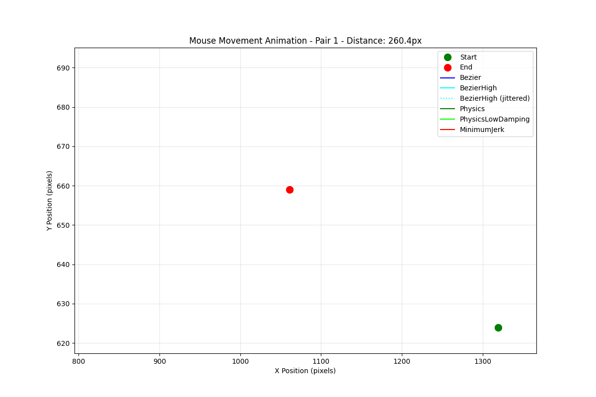
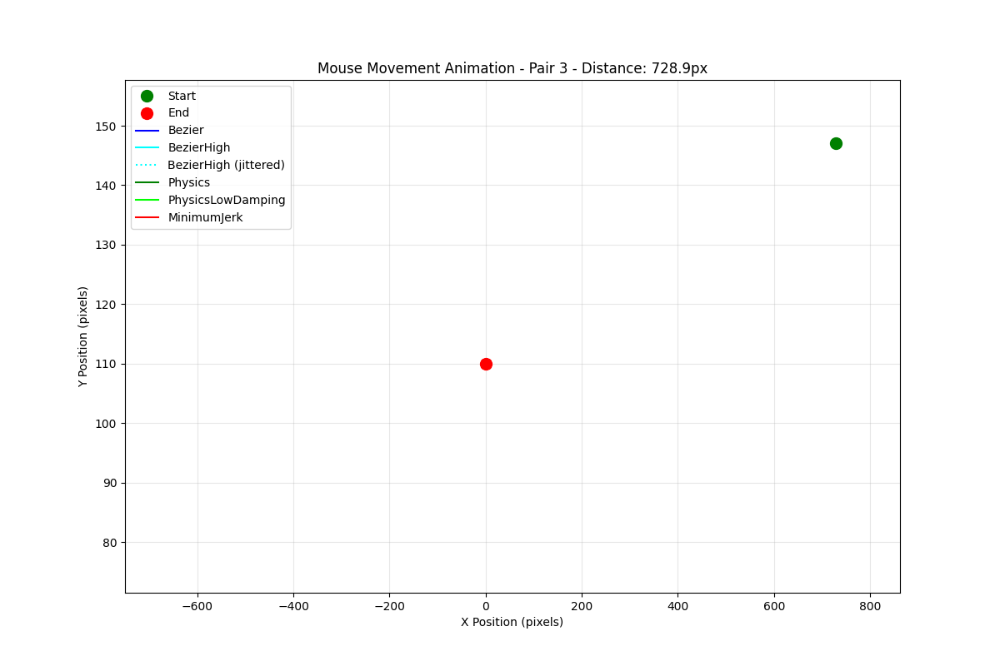

# MouseWont: Human-like Mouse Movement Simulation

Version: 0.1.0
Author: Mika Tokamak
Last Modified: 2025-11-05

MouseWont is a multi-language framework for generating and executing realistic human-like mouse movements.
It was inspired by a friend who discussed the complications of creating human-like movements in testing applications or even security applications 
@Pilsy, thanks for the challenge. The mathematics is sound, I was surprised by the .ts outperforming compiled C++.

I can extend this much more, but it should give you a good idea of the combinations needed to create random human-like movement.

## Quick Start

### Installation

```bash
# Clone the repo
git clone https://github.com/your-username/mousePlayWrong.git
cd mousePlayWrong

# Install dependencies
npm install

# Build the project (compiles TypeScript)
npm run build

# Run with precompiled native binaries
# The binaries are already included in the repository!
```

### Building Native Components (Optional)

Precompiled binaries are included in the `native/bin` directory, but if you want to build them yourself:

```bash
# Build C++ addon
npm run build:cpp

# Build Fortran module
npm run build:fortran

# Or build all native components at once
npm run build:natives

# Copy binaries to the native/bin directory
npm run copy:binaries
```

### Basic Usage (TypeScript)

```typescript
import { MouseController, MovementOptions, MovementStrategy } from './src';

async function demo() {
  // Create controller with default options
  const controller = new MouseController();
  
  // Get current mouse position
  const currentPos = await controller.getMousePosition();
  console.log(`Current position: (${currentPos.x}, ${currentPos.y})`);
  
  // Move mouse with custom options
  const options: MovementOptions = {
    strategy: MovementStrategy.COMPOSITE,
    duration: 1.5,
    overshootFactor: 0.3,
    jitterAmount: 1.5,
    complexity: 0.7,
    pathPoints: 100,
    velocityProfile: "asymmetric"
  };
  
  await controller.moveMouse(500, 300, options);
  
  // Perform a click
  await controller.click("left", 2);
}

demo().catch(console.error);
```

## Key Features

- Multiple movement algorithms (Bezier, Physics, Minimum Jerk, Composite, Adaptive)
- Multi-language support (TypeScript, Python, C++, Fortran)
- Hardware integration capabilities
- Realistic human-like movements with configurable parameters
- Highly optimised for performance

## Movement Strategies

- **Bezier**: Smooth curved paths using Bezier curves
- **Physics**: Realistic movements based on physical simulation
- **Minimum Jerk**: Precise movements with optimised jerk profile
- **Composite**: Combines multiple strategies for complex movements
- **Adaptive**: Automatically selects the best strategy based on parameters

## Backend Options

- **Direct**: Native OS integration
- **Python**: Python-based movement execution
- **C++**: High-performance C++ implementation
- **Hardware**: Optional hardware integration (STM32/FTDI)

## Examples

Check out the examples directory for more detailed usage scenarios:
- Basic usage
- Parallel path generation
- Thread pool utilisation
- Symbolic math extraction

## Performance Optimisation

The system includes various performance optimisations:
- Pooled memory allocators
- Fortran for physics calculations
- SIMD instructions for vector operations
- Lookup tables for common easing functions
- Pre-generated random sequences

## Running Examples

```bash
# Run the basic example
npm run example:basic

# Run symbolic math extraction example
npm run example:symbolic

# Run context-aware examples
npm run example:context
npm run example:context-visualize
npm run example:context-integration

# Run benchmarks
npm run benchmark
npm run benchmark:math
```

## Entry Points

The main entry points for the project are:

1. Main library API: `src/index.ts` - Export of all public APIs
2. Examples: `src/examples/*.ts` - Demonstration of various features
3. Core implementation: `src/core/MousePlayWrong.ts` - Main controller class

## Performance Analysis

### Algorithm Performance

The project includes several different movement algorithms with varying performance characteristics:

| Algorithm | Best Implementation | Key Characteristics |
|-----------|---------------------|---------------------|
| Bézier Curve | TypeScript | Smooth movements, computationally efficient |
| Minimum Jerk | TypeScript | Biomechanically accurate, very smooth |
| Physics-based | TypeScript | Realistic momentum and overshoot effects |
| Ornstein-Uhlenbeck | C++ | Realistic stochastic jitter, benefits from native code |

### Surprising Findings

Contrary to expectations, TypeScript outperforms C++ in most algorithms except the Ornstein-Uhlenbeck process. This is likely due to:

- Overhead of crossing the JavaScript /C++ boundary through Node.js addons
- V8's Just-In-Time compilation optimises the TypeScript code very effectively
- Data copying between JavaScript and C++ creates additional overhead

The Ornstein-Uhlenbeck process is the only algorithm where C++ implementation outperforms TypeScript (1.68x faster), suggesting stochastic processes benefit most from C++ optimisation.

### Implementation Recommendations

- **Use TypeScript for**:
  - Bézier curve generation (5x faster than C++)
  - Minimum jerk trajectories (1.3x faster than C++)
  - When simplicity and portability are priorities

- **Use C++ for**:
  - Ornstein-Uhlenbeck process (1.7x faster than TypeScript)
  - When performing many stochastic calculations
  - For huge batches of calculations

## Visual Examples

The output directory contains animated visualisations of the different movement styles:


*Example of different movement strategies between the same start and end points*


*Comparison of movement with and without jitter applied*

You can view more detailed performance comparisons in the HTML report at `output/performance_comparison.html`.

## License

This project is for demonstration purposes only. The mathematical formulas have been derived into new, alternate, enhanced algorithms for this objective.
